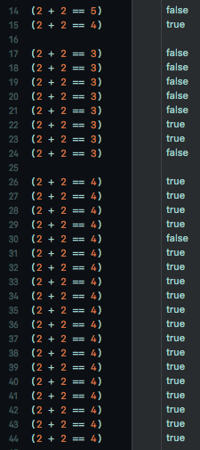

# AltBool

Fun with Swift operators. 

Just for fun, this is an extension to Swift's `Int` that replaces the `==` operator with a version that randomly returns an incorrect result. For best results, add this to a large commit. The kind that causes a code reviewer's eyes to glaze over, and will eventually get rubber stamped into the project.

```swift
extension Int {
    static func == (left:Int, right:Int) -> Bool {
        let odds = 20
        if (arc4random_uniform(UInt32(odds)) >= (odds - 1)) {
            return (left != right)
        }
        
        return !(left != right)
    }
}
```

The return line has its screwy logic of `!(left != right)` because, as we're replacing the `==` behavior, we can't do a simple `(left == right)` for when we want this to behave correctly.


## Demo
This repository contains a Swift Playground that demonstrates the fun. Run the playground a few times, and you'll see the results.

